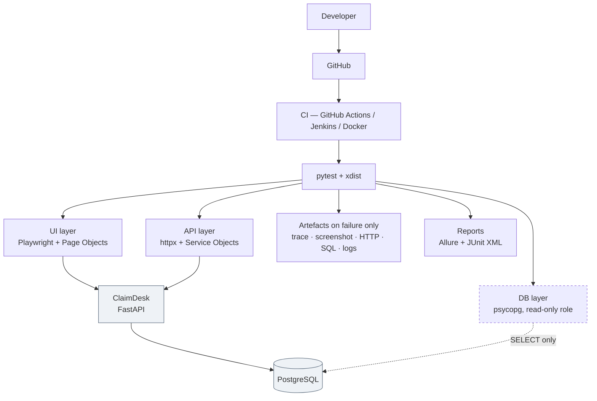

# ClaimDesk QA — End-to-End SDET Automation Framework

[](https://github.com/codernik-dev/playwright-python-sdet-framework/actions/workflows/tests.yml)
[](https://github.com/codernik-dev/playwright-python-sdet-framework/actions/workflows/nightly.yml)
[](https://github.com/codernik-dev/playwright-python-sdet-framework/actions/workflows/docker.yml)

**Python · pytest · Playwright · httpx · PostgreSQL · Allure · Docker · Jenkins · GitHub Actions**

A production-style test automation framework that exercises an insurance-claims application
through three independent layers — **browser, REST API, and database** — with the discipline of
a real engineering codebase: an installable package, strict typing, architecture decision
records, and a lint rule that makes the black-box boundary impossible to violate.

> **Every number below was produced by a command that was run.** Where something was written
> but not executed, it says so — see [docs/progress.md](docs/progress.md), which separates
> ✅ VERIFIED from ⚠️ NOT VERIFIED throughout.

---

## Current state — measured, not asserted

| | |
|---|---|
| **Tests passing** | **351** — 130 framework, 157 API, 32 browser, 28 database, 4 end-to-end |
| **Negative / boundary coverage** | **136 negative**, 28 boundary, 23 authorisation, 22 integrity |
| **Serial run** | `351 passed` in **24.88 s** (median of 3, AMD Ryzen 7 5800H) |
| **Parallel run** (`-n 4`) | `351 passed` in **16.82 s** — 1.48× faster, and [why `-n auto` is *worse*](docs/phase-15-measurement.md) |
| **Flake rate** | **0 over 10 consecutive `-n 4` runs** (3,510 test executions) |
| **Application's own tests** | 58 (the app under test is real, not a stub) |
| **Quality gate** | ruff · ruff-format · **mypy `strict` across 94 files** · every pre-commit hook |
| **CI** | GitHub Actions PR gate + nightly Chromium/Firefox/WebKit · **Jenkins, 351 green on a real controller** · **351 green in Docker Compose** |

---

## The application is a fixture. The framework is the deliverable.

`app/` contains **ClaimDesk**, a small FastAPI + PostgreSQL claims portal. It exists only to
give the framework something realistic to test: authentication, three roles, a status machine,
monetary boundaries, an audit trail and a payout ledger.

The framework **never imports application code**. It reaches the application only over HTTP and
read-only SQL — exactly as an SDET does in a real job — and that boundary is enforced three
ways, none of which rely on good intentions:

```toml
# pyproject.toml — the linter refuses the import
[tool.ruff.lint.flake8-tidy-imports.banned-api]
"claimdesk".msg = "The test framework must NEVER import the application under test."
```

```
TID251 `claimdesk` is banned: The test framework must NEVER import the application under test.
 --> tests/api/_ban_probe.py:1:1
```

- The **database role** holds `SELECT` and nothing else, so a test physically cannot manufacture
  state the application would never produce. An `INSERT` fails with `InsufficientPrivilege`.
- The **test image** does not contain the application at all, and CI asserts that
  `import claimdesk` fails inside it.

---

## Architecture



The dashed line is the point: the framework **reads** the database, never writes to it.

---

## What makes this not a toy project

Real problems, found by running the thing, fixed with the reasoning written down.

**A negative test that passed for the wrong reason.** `GET /claims` with no `Authorization`
header returned `200`. It looked like an auth bypass; `curl` proved the application was correct.
`httpx` persists cookies, so a leftover session cookie from an earlier login had quietly
authenticated the "anonymous" request. That check *would have kept passing with authentication
removed entirely.* Now every identity gets its own cookie-less client —
[ADR 0007](docs/adr/0007-no-shared-cookie-jar.md).

**A 3.5× slowdown that was not the application's fault.** Every API test spent ~0.4 s in *setup*
while its assertions ran in 0.02 s and the application answered in 2.8 ms. **Uniform overhead
rules out the product** — real performance problems are lumpy. Measured: `httpx.Client()` builds
a fresh SSL context per instance (355 ms), and the framework builds one client per identity per
test. One shared context: **107.19 s → 30.14 s.** Two regression tests pin it — one that the
context is reused, one that it still *verifies certificates*, so the tempting wrong fix fails
the suite instead of passing it.

**A bug that had never failed.** The application refuses future incident dates, and the suite
asserts both sides of that boundary. Both used `date.today()` — the *local* date of whichever
machine asked. Fine on one machine. Then Docker made them two: a UTC container and an IST
runner. Between 00:00 and 05:30 the runner is a day ahead, so "an incident dated today is
accepted" would fail for **five and a half hours a day**, in one environment, while its matched
pair still passed and hid half the problem. Both sides now answer in UTC explicitly.

**Reporting where every failure category silently matched nothing.** Allure requires a *full*
match and `.` does not cross newlines, so no stack trace could ever match, everything fell
through to the catch-all, and the report looked perfectly healthy while triage had stopped
working. My unit test had passed because it fed the regex a one-line trace. *A test that feeds
simpler input than reality is a rehearsal.*

**A `.gitignore` pattern that had never matched the file it was written for.** `*.junit.xml`
requires a dot before the word; `junit.xml` is what `--junitxml=junit.xml` produces. A near-miss
glob is worse than no glob, because it looks handled.

**The same concurrency bug, written twice, in two different layers.** A pagination test and a
database count test both asserted on a *global* fact in a database other workers were writing
to. After fixing it twice the fix stopped being the point: **a test may assert an invariant
globally — it holds no matter who else is writing — but never an aggregate.**

**`information_schema` is privilege-filtered, and least privilege exposed it.** A constraint
query returned zero rows for the read-only role and sixteen for the owner. The test *would have
passed* against a superuser. Switched to `pg_catalog`.

**A live bearer token written into `artifacts/`** — the directory CI archives and publishes.
Nothing failed; it was caught by re-reading the file.

**A finding that was not a bug.** Non-ASCII digits (`１２３`, `١٢٣`) are accepted and normalised.
Assessed low severity — unambiguous value, no rule bypassed — so it is a characterisation test
with the reasoning recorded, not a "fix". Knowing which findings are bugs is the actual skill.

---

## Test design

Negative and boundary coverage is **generated from the published contract**, not hand-written:

```python
def illegal_transitions():
    return tuple(
        (action, status)
        for action in ClaimAction
        for status in ClaimStatus
        if (action, status) not in _LEGAL_PAIRS
    )
```

30 negative cases from one comprehension — and a new status automatically brings its own
negative cases. The positive tests are driven from the *same* table, so the two cannot drift.

Other rules the suite holds itself to:

- Every boundary is asserted **at**, **just inside** and **just outside** the limit.
- Every "must be refused" test is paired with a "must be allowed" test. A suite that only proves
  refusals also passes against an API that refuses everything.
- Every refusal test asserts the resource **did not move**.
- `404` for another customer's claim, `403` for a missing role — because `403` confirms a
  resource exists and turns identifier guessing into an enumeration oracle.

---

## Failure diagnosis

Passing tests leave nothing behind. Failing tests leave everything, **attached to the report**
rather than only sitting on a CI runner:

| Artefact | Answers |
|---|---|
| test log | what the framework did, correlation id on every line |
| HTTP exchanges | every request and response, from every client, in one timeline |
| SQL executed | what the database actually contained, and the row counts |
| screenshot · page HTML | what the user saw · whether the element existed at all |
| `trace.zip` | `playwright show-trace` — time-travel DOM, network and console |

Failures are **classified before they are read**. The categories key on exception types the
framework raises deliberately, so a database outage produces *13 environment problems*, not 13
product defects. The runbook is [docs/debugging.md](docs/debugging.md).

Every request carries an `X-Request-Id` derived from the test's node id, and the application
logs it — so one `grep` joins the test log, the HTTP exchange and the server-side stack trace.

---

## Getting started

Requires Python 3.11–3.13 and PostgreSQL binaries (used to build a throwaway cluster; your own
databases are never touched).

```powershell
py -3.12 -m venv .venv
.\.venv\Scripts\Activate.ps1
pip install -e ".[dev,app]"

# Both hook types: plain `pre-commit install` wires up only the first, and the
# commit-msg hook would then never run - silently, and only for some people.
pre-commit install --hook-type pre-commit --hook-type commit-msg

Copy-Item .env.example .env          # then set the two passwords

.\scripts\local_db.ps1 start          # disposable cluster on port 55432
python -m uvicorn claimdesk.main:app --app-dir app --host 127.0.0.1 --port 8000
```

Then, in a second terminal:

```powershell
pytest -m framework -q     # 130 unit tests, no application required
pytest -m api -q           # 157 API tests
pytest -m ui -q            # 32 browser tests (run `playwright install chromium` once)
pytest -m db -q            # 28 read-only database checks
pytest -m e2e -q           # 4 browser -> API -> database journeys

.\scripts\run_suite.ps1                       # everything: parallel pass, then serial pass
.\scripts\run_suite.ps1 -Workers 4 -Allure    # ... and write Allure results
.\scripts\report.ps1                          # generate and open the report
.\scripts\benchmark.ps1                       # serial vs parallel, measured honestly
```

Sign in at <http://127.0.0.1:8000/login> as `customer@example.com` / `Passw0rd!seed`.
Interactive API docs: <http://127.0.0.1:8000/docs>.

### Everything in containers instead

```powershell
docker compose --profile test -f docker/docker-compose.yml build
docker compose -f docker/docker-compose.yml up -d db sut
docker compose -f docker/docker-compose.yml run --build --rm tests
```

Verified: **`351 passed in 36.39s`** inside the containerised runner, with the black-box
boundary asserted in the image itself (`import claimdesk` fails, proved against a positive
control). Getting there exposed four defects that were invisible in review — including a
compose service named `app`, which broke *every* browser test because `.app` is an
HSTS-preloaded gTLD and Chromium refuses to speak HTTP to it. See
[docs/phase-10-docker.md](docs/phase-10-docker.md).

### If PostgreSQL is not installed

The scripts need only the server binaries, not an installed service:

```powershell
$env:PGBIN = "C:\path\to\pgsql\bin"   # the folder containing pg_ctl.exe
.\scripts\local_db.ps1 start
```

### If `pip install` fails with a TLS certificate error

```
Could not find a suitable TLS CA certificate bundle, invalid path: ...\ssl\certs\ca-bundle.crt
```

Some PostgreSQL installers set `CURL_CA_BUNDLE` to a path that does not exist. An environment
problem rather than a project one, but it fails at the very first step:

```powershell
Remove-Item Env:CURL_CA_BUNDLE -ErrorAction SilentlyContinue
```

---

## Project structure

```
src/claimdesk_qa/        the framework — an installable package
  config/                typed, validated, secret-safe settings
  core/                  artefacts · correlation · logging · readiness · recording · clock · TLS
  api/                   HTTP client, response contracts, service objects
  db/                    read-only connection, typed rows, query objects
  ui/                    base page, components, page objects, session injection
  reporting/             Allure environment, failure categories, CI executor
  data/                  factories and seeded-data constants
  domain.py              the framework's OWN copy of the business rules
tests/
  framework/             unit tests for the framework itself
  api/  ui/  db/  e2e/   one directory per layer; markers applied by location
  _fixtures/             shared fixtures, registered as pytest plugins
app/                     ClaimDesk — the application under test (a fixture)
docker/                  Dockerfiles, compose, database init
docs/                    design, per-phase teaching notes, ADRs, runbook
scripts/                 bootstrap · quality gate · database · suite · report · benchmark
Jenkinsfile              parameterised declarative pipeline, executed on a real controller
```

---

## Documentation

| Document | What it covers |
|---|---|
| [docs/progress.md](docs/progress.md) | **Build log — what is done, what is verified, what is not** |
| [docs/debugging.md](docs/debugging.md) | The failure runbook: CI is red at 03:00, do this in this order |
| [docs/phase-1-design.md](docs/phase-1-design.md) | Architecture, test strategy, 69-case matrix, risk register |
| [docs/phase-15-measurement.md](docs/phase-15-measurement.md) | Every number, how it was produced, and how easily these numbers lie |
| [docs/interview-preparation.md](docs/interview-preparation.md) | The questions that decide it — including the five I would struggle with |
| [docs/adr/](docs/adr/) | Architecture Decision Records — the "why" behind each choice |
| Phase notes | [2](docs/phase-2-repository-and-configuration.md) · [3](docs/phase-3-application-under-test.md) · [4](docs/phase-4-pytest-foundation.md) · [5](docs/phase-5-api-automation.md) · [6](docs/phase-6-playwright-ui.md) · [7](docs/phase-7-database-validation.md) · [8](docs/phase-8-reporting.md) · [9](docs/phase-9-parallel-execution.md) · [10](docs/phase-10-docker.md) · [11](docs/phase-11-jenkins.md) · [12](docs/phase-12-github-actions.md) · [13](docs/phase-13-quality-pass.md) |

---

## Deliberately not included

Kubernetes · Selenium Grid · Terraform · Kafka · a BDD/Cucumber layer · a keyword-driven DSL ·
a `BaseTest` inheritance hierarchy · a hand-rolled wait utility · a separate JSON-Schema repo.

Each is either solved better by something already in the stack (Playwright's `expect`
auto-retries; pytest fixtures beat base classes) or adds operational weight with no reviewer
value. **Unjustified technology reads as a lack of judgement, not as ambition.**

Also not claimed: load testing, security scanning, visual regression, accessibility beyond a
smoke check, and any application code-coverage figure — black-box tests do not produce a
meaningful one, and quoting it would imply a relationship that does not exist.

---

## Author

**Nikesh Walia** — QA / Test Automation Engineer moving toward SDET.

## Licence

[MIT](LICENSE)
