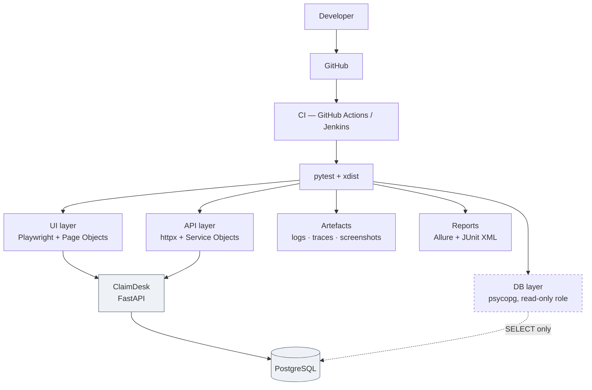

# ClaimDesk QA — End-to-End SDET Automation Framework

**Python · pytest · Playwright · httpx · PostgreSQL · Docker · Jenkins · GitHub Actions**

A production-style test automation framework that exercises an insurance-claims application through
three independent layers — **browser, REST API, and database** — with the discipline of a real
engineering codebase: an installable package, strict typing, architecture decision records, and a
lint rule that makes the black-box boundary impossible to violate.

> **Build in progress.** Phases 1–6 of 18 are complete and verified. Every claim below was produced
> by a command that was actually run — see [docs/progress.md](docs/progress.md), which separates
> ✅ VERIFIED from ⚠️ NOT VERIFIED throughout. No pass-rate, timing or coverage figure appears
> anywhere in this repository until it has been measured.

---

## Current state — measured, not asserted

| | |
|---|---|
| **Tests passing** | **261** — 72 framework, 157 API, 32 browser |
| **Serial run** | `261 passed in 21.04s` |
| **Parallel run** (`-n 4`) | `261 passed` in **12.81 / 13.46 / 12.86 / 13.10 / 13.20 s** — five consecutive runs, no flakes |
| **Application's own tests** | 58 (the app under test is real, not a stub) |
| **Quality gate** | ruff clean · ruff-format clean · **mypy `strict` clean across 69 files** |

---

## The application is a fixture. The framework is the deliverable.

`app/` contains **ClaimDesk**, a small FastAPI + PostgreSQL claims portal. It exists only to give the
framework something realistic to test: authentication, three roles, a status machine, monetary
boundaries, an audit trail and a payout ledger.

The framework **never imports application code**. It reaches the application only over HTTP and
read-only SQL — exactly as an SDET does in a real job — and that boundary is **enforced by the
linter**, not by good intentions:

```toml
# pyproject.toml
[tool.ruff.lint.flake8-tidy-imports.banned-api]
"claimdesk".msg = "The test framework must NEVER import the application under test."
```

Verified by adding a violating file and watching CI-grade linting reject it:

```
TID251 `claimdesk` is banned: The test framework must NEVER import the application under test.
 --> tests/api/_ban_probe.py:1:1
```

The database role the tests use holds `SELECT` and **nothing else**, so a test physically cannot
manufacture state the application would never produce. Attempting an `INSERT` fails with
`InsufficientPrivilege`.

---

## Architecture



The dashed line is the point: the framework **reads** the database, never writes to it.

---

## What makes this not a toy project

Real problems, found by running the thing, fixed with the reasoning written down.

**A negative test that passed for the wrong reason.** `GET /claims` with no `Authorization` header
returned `200`. It looked like an auth bypass; `curl` proved the application was correct. `httpx`
persists cookies, so a leftover session cookie from an earlier login had quietly authenticated the
"anonymous" request. That check *would have kept passing with authentication removed entirely.* Now
every identity gets its own cookie-less client — [ADR 0007](docs/adr/0007-no-shared-cookie-jar.md).

**A 35× speedup that was not the application's fault.** 21 tests took 48.17 s, with every request
costing ~2.1 s *uniformly* — and uniform overhead rules out the application, because real performance
problems are lumpy. Measured: `localhost` 2034 ms vs `127.0.0.1` 10 ms. `localhost` resolves to `::1`
first and the app binds IPv4 only. One configuration value: **48.17 s → 1.36 s**.

**Three silent logging failures.** None made a test fail; all destroyed evidence. Handler-level
filters mutate a *shared* `LogRecord`, so ordering decided the correlation id. Moving the filter to
the logger was worse — logger filters don't apply to records from *child* loggers, so lines vanished
entirely. And setting the logger to `INFO` left every per-test log file empty.

**A specification that lost an argument with a test.** My own matrix said a withdrawn claim should
`404`. The app returned `200 WITHDRAWN` — and since `WITHDRAWN` is a published, *filterable* status,
a 404 on the detail endpoint would contradict the list endpoint. I corrected the specification, not
the product.

**A flaky test that was reproduced instead of retried.** A pagination test failed ~50% of the time
at `-n 4` and never serially: other workers inserted rows between the two page requests, moving a
claim from page one to page two. The assertion was right and the *premise* was wrong — you cannot
paginate a data set that is being written to. Scoped to the immutable seeded corpus; five consecutive
clean runs. A retry would have hidden the lesson.

**A finding that was not a bug.** Non-ASCII digits (`１２３`, `١٢٣`) are accepted and normalised.
Assessed low severity — unambiguous value, no rule bypassed — so it is a characterisation test with
the reasoning recorded, not a "fix". Knowing which findings are bugs is the actual skill.

---

## Test design

Negative and boundary coverage is **generated from the published contract**, not hand-written:

```python
def illegal_transitions():
    return tuple(
        (action, status)
        for action in ClaimAction
        for status in ClaimStatus
        if (action, status) not in _LEGAL_PAIRS
    )
```

30 negative cases from one comprehension — and a new status automatically brings its own negative
cases. The positive tests are driven from the *same* table, so the two sets cannot drift apart.

Other rules the suite holds itself to:

- Every boundary is asserted **at**, **just inside** and **just outside** the limit. Testing only
  "too big" proves rejection works but says nothing about whether the accepted range is right.
- Every "must be refused" test is paired with a "must be allowed" test. A suite that only proves
  refusals also passes against an API that refuses everything.
- Every refusal test asserts the resource **did not move**. A refusal that still changes state is
  worse than no refusal.
- `404` for another customer's claim, `403` for a missing role — because `403` confirms a resource
  exists and turns identifier guessing into an enumeration oracle.

---

## Getting started

Requires Python 3.11 and PostgreSQL (any recent version — the binaries are used to build a
throwaway cluster; your own databases are never touched).

```powershell
py -3.11 -m venv .venv
.\.venv\Scripts\Activate.ps1
pip install -e ".[dev,app]"

Copy-Item .env.example .env

.\scripts\local_db.ps1 start          # disposable cluster on port 55432
python -m uvicorn claimdesk.main:app --app-dir app --port 8000
```

Then, in a second terminal:

```powershell
pytest -m framework -q     # 72 unit tests, no application required
pytest -m api -q           # 157 API tests
pytest -m ui -q            # 32 browser tests (run `playwright install chromium` once)
pytest -q -n 4             # everything, in parallel
```

Sign in at <http://127.0.0.1:8000/login> as `customer@example.com` / `Passw0rd!seed`.
Interactive API docs: <http://127.0.0.1:8000/docs>.

Useful commands:

```powershell
.\scripts\quality.ps1              # the exact CI gate: ruff + mypy + unit tests
.\scripts\local_db.ps1 reset       # destroy all local test data and rebuild
pytest -m "api and boundary" -q    # slice the suite by intent
```

---

## Project structure

```
src/claimdesk_qa/        the framework — an installable package
  config/                typed, validated, secret-safe settings
  core/                  artefacts · correlation · logging · readiness
  api/                   HTTP client, response contracts, service objects
  data/                  factories and seeded-data constants
  domain.py              the framework's OWN copy of the business rules
tests/
  framework/             unit tests for the framework itself
  api/  ui/  db/  e2e/   one directory per layer; markers applied by location
app/                     ClaimDesk — the application under test (a fixture)
docs/                    design, per-phase teaching notes, ADRs
scripts/                 bootstrap, quality gate, disposable database
```

---

## Documentation

| Document | What it covers |
|---|---|
| [docs/progress.md](docs/progress.md) | **Build log — what is done, what is verified, what is not** |
| [docs/phase-1-design.md](docs/phase-1-design.md) | Architecture, test strategy, 69-case test matrix, risk register |
| [docs/phase-2…](docs/phase-2-repository-and-configuration.md) · [3](docs/phase-3-application-under-test.md) · [4](docs/phase-4-pytest-foundation.md) · [5](docs/phase-5-api-automation.md) | Per-phase: the problem, the decision, how to prove it, interview Q&A |
| [docs/adr/](docs/adr/) | Architecture Decision Records — the "why" behind each choice |

---

## Roadmap

Phases 1–6 complete. Remaining: database validation · Allure reporting · cross-browser coverage ·
Docker · Jenkins pipeline · GitHub Actions · measurement.
Tracked in [docs/progress.md](docs/progress.md).

---

## Author

**Nikesh Walia** — QA / Test Automation Engineer moving toward SDET.

## Licence

[MIT](LICENSE)
