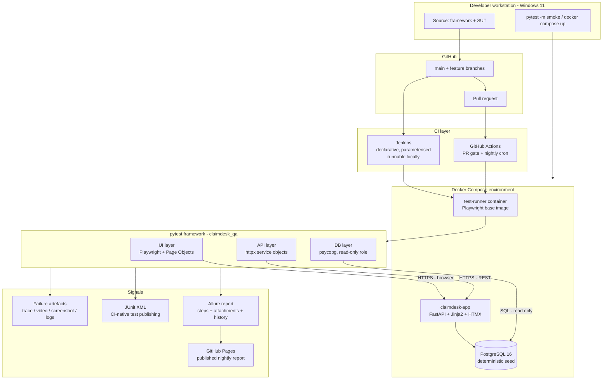
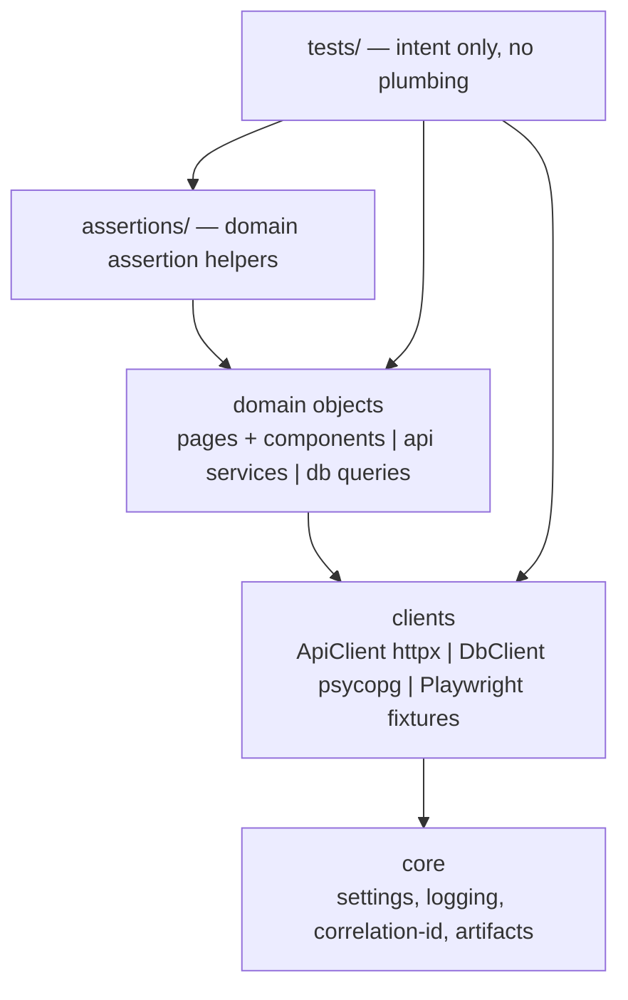
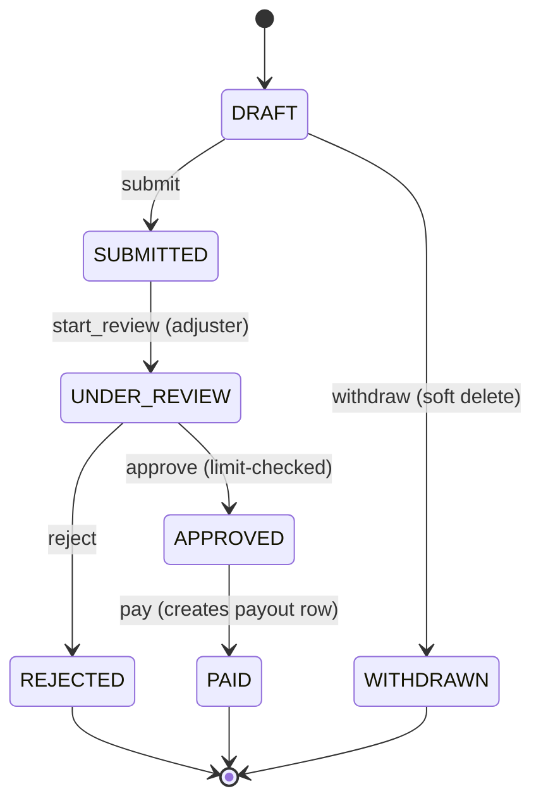
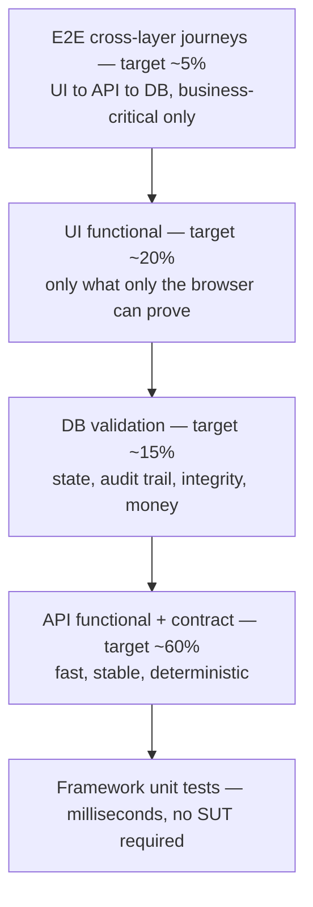

# PHASE 1 — Project Design & Architecture

> Status: **DESIGN ONLY — nothing implemented yet.** No results, timings, pass rates or
> coverage numbers appear in this document because none have been measured.
> Anything requiring execution is marked `NOT VERIFIED`.

---

## 1. Project name

| Thing | Name | Notes |
|---|---|---|
| GitHub repository | **`playwright-python-sdet-framework`** | Keyword-forward for recruiter/ATS search: tool + language + role + artefact type |
| Framework (README title) | **ClaimDesk QA — End-to-End SDET Automation Framework** | Python · Playwright · pytest · PostgreSQL · Docker · Jenkins |
| System Under Test (SUT) | **ClaimDesk** | A small containerised insurance-claims portal. A *fixture*, not the achievement |
| Python package | `claimdesk_qa` | Installed with `pip install -e .` — no `sys.path` hacks |

---

## 2. One-paragraph overview

ClaimDesk QA is a production-style test automation framework for **ClaimDesk**, a containerised
insurance claims intake and adjudication portal. The framework exercises the application the way a
real quality engineer would: through the browser (Playwright), through the public REST API (httpx),
and against the PostgreSQL database (read-only SQL) — never by importing application code. It is
organised as an installable Python package with a layered architecture (config → clients → domain
objects → assertions → tests), runs in Docker for environment parity, executes in parallel under
pytest-xdist, publishes Allure and JUnit reports, captures Playwright traces/videos/screenshots and
correlated logs on failure only, and is wired into both GitHub Actions (PR gate + nightly
cross-browser regression) and a runnable Jenkins declarative pipeline.

---

## 3. Business / domain explanation

**ClaimDesk** models the core of a motor-insurance claims workflow (FNOL → adjudication → payout).

**Actors / roles**

| Role | Can do |
|---|---|
| `CUSTOMER` | Submit claims against their own policies, view/edit their own draft claims, withdraw drafts |
| `ADJUSTER` | View all claims, move claims through review, approve/reject **up to an approval limit** |
| `ADMIN` | Everything an adjuster can, plus approve above the limit, manage users, deactivate accounts |

**Entities**

`users` · `policies` · `claims` · `claim_events` (immutable audit trail) · `payouts`

**Business rules (these are what the tests actually prove)**

1. `0 < claim.amount <= policy.coverage_limit` — otherwise rejected with `422`.
2. Adjuster approval limit = **5000.00**. Above that, only `ADMIN` may approve → `403`.
3. Status machine: `DRAFT → SUBMITTED → UNDER_REVIEW → (APPROVED | REJECTED)`, and `APPROVED → PAID`.
   Any other transition → `409 Conflict`.
4. `PAID` and `REJECTED` claims are immutable.
5. Every status change writes exactly one `claim_events` row (`actor_id`, `from_status`, `to_status`, `occurred_at`).
6. Reaching `PAID` creates exactly one `payouts` row whose amount equals the approved claim amount.
7. A customer may only see their own claims — cross-tenant access returns `404` (not `403`, to avoid resource enumeration).
8. Money is `NUMERIC(12,2)` — never a float.

### Why this domain (and not a to-do app / e-commerce demo)

- **Every construct an SDET must demonstrate appears naturally**: authentication, RBAC, a state
  machine, monetary boundary values, an audit trail, search/filter/sort/pagination, form validation,
  data tables, and multi-role workflows. Nothing has to be bolted on artificially.
- **It creates genuine reasons to validate the database.** A UI that shows "Approved" proves nothing
  about whether the payout ledger row was written — that is exactly the class of defect DB validation
  exists to catch, and it is a real production failure mode (money moved twice / never).
- **It is recruiter-legible.** Insurance / fintech / claims domains dominate enterprise QA job
  postings; the vocabulary transfers directly into interview conversation.
- **It is small.** The SUT is ~10 endpoints and ~6 pages. It can be built in one phase and then
  deliberately ignored.

---

## 4. Why this project is realistic

| Realistic because | Detail |
|---|---|
| Black-box boundary | Tests reach the SUT **only** over HTTP and SQL. The framework never imports `app/`. This is the real constraint an SDET works under and it is enforced by a lint rule in CI. |
| Real, runnable environment | `docker compose up` gives Postgres + app with deterministic seed data. No dependency on a flaky public demo site that changes without notice. |
| Layered coverage matches industry practice | Most coverage at the API layer, DB checks for state integrity, a thin high-value UI layer, few cross-layer journeys. |
| Two CI systems for two real reasons | GitHub Actions is the CI that actually runs on the public repo; Jenkins is what most enterprises actually use — and the Jenkinsfile is executable against a local Jenkins container, not decorative. |
| Honest engineering artefacts | ADRs, a test matrix, a documented flaky-test policy, a debugging runbook, `.env.example`, no secrets in git. |
| Windows-first developer experience | You develop on Windows 11; scripts and docs are written for PowerShell **and** bash, and CI runs Linux — the drift is acknowledged, not hidden. |

### Why NOT a public demo application

I evaluated the usual candidates before choosing to containerise a local SUT:

| Candidate | Why rejected |
|---|---|
| SauceDemo | No API, no DB access, no roles beyond canned users, no CRUD. Cannot demonstrate half the required skills. |
| OrangeHRM demo / DemoQA | Shared public state — other people's data mutates under your tests. Instant flakiness, unfixable. |
| ParaBank | Shared state, unstable uptime, SOAP-era API, no DB access. |
| restful-booker | API only, resets periodically, no UI, no DB. |
| RealWorld/Conduit | Genuinely good API+UI+DB, but the reference stacks drift across implementations and add a Node build chain. High setup cost, low marginal demonstration value. |

**Decision:** none of them expose a database, and DB validation is a required pillar of this project
(and of your existing professional profile). A purpose-built, containerised SUT is the only option
that supports the full UI + API + DB story *and* is reproducible on a clean machine.

**The credibility risk of "you tested your own app" is mitigated explicitly:**

1. The framework never imports application code — enforced by a CI lint rule.
2. The SUT lives in `app/`, is documented as a fixture, and has its own separate minimal unit tests.
3. The README states this in the first screen: *"The application is a fixture. The framework is the deliverable."*
4. The SUT is intentionally left with realistic rough edges (a real state machine, real validation
   messages) rather than being shaped to make tests easy.

---

## 5. What an SDET is responsible for here

This maps 1:1 to what you will claim in interviews.

1. **Test strategy** — deciding what is tested at which layer and why; owning the test matrix.
2. **Framework architecture** — a maintainable, layered, installable codebase other engineers can extend.
3. **Coverage across layers** — UI, API, DB, and cross-layer journeys.
4. **Test data ownership** — deterministic seed data, per-test data creation, isolation under parallelism.
5. **Environment engineering** — containerised, reproducible, configuration-driven, secret-free.
6. **CI/CD integration** — what runs on a PR vs nightly, artefact retention, gating policy.
7. **Diagnosability** — when CI goes red at 03:00, an engineer must diagnose it from artefacts alone.
8. **Flake management** — measuring, quarantining, and fixing flakiness rather than hiding it behind retries.
9. **Quality signals to the team** — reports that answer "what broke, where, in which environment, why".
10. **Framework quality itself** — the framework has its own unit tests, linting, and type checking.

---

## 6. High-level architecture



### Framework internal layering



**Dependency rule:** arrows only point downward. A page object never imports a test; a test never
builds an httpx request by hand; nothing imports `app/`.

### Claim state machine (the test-design source of truth)



Every transition that is **not** on this diagram is a negative test expecting `409`.

---

## 7. Technology stack and decisions

| Concern | Choice | Why this, not the alternative |
|---|---|---|
| Language | **Python 3.11 local / 3.12 in container** | You already work in Python. Avoiding 3.14 locally is deliberate: it is newer than most plugin ecosystems are tested against, and the Playwright container ships 3.12. `requires-python = ">=3.11,<3.14"` = the range we will actually test. |
| Test runner | **pytest** | Fixtures give real dependency injection with scopes and finalisation; markers give selective execution; parametrisation is first-class; the plugin ecosystem (xdist, rerunfailures, allure) is unmatched. Alternatives (unittest, robot) trade power for ceremony. |
| UI automation | **Playwright + `pytest-playwright`** | Auto-waiting actionability checks, browser contexts (fast, isolated sessions), `storage_state` reuse, and the trace viewer — the best CI-failure debugging tool available. `pytest-playwright` supplies `page`/`context`/`browser` fixtures and CLI flags for trace/video/screenshot policy; we layer our own fixtures on top rather than re-inventing them. |
| API automation | **httpx** (sync client) | Same ergonomics as `requests`, plus a reusable pooled `Client`, mandatory timeouts by design, HTTP/2 capable, typed and actively maintained. `requests` would also work — this is a preference, recorded in an ADR, not a religion. |
| Response contracts | **pydantic v2 models** | One typed definition serves as schema validation *and* as an ergonomic object in assertions. Avoids maintaining separate JSON-Schema files that drift. |
| Database access | **psycopg 3**, raw parameterised SQL | Deliberately **no ORM**. The framework must verify what is *actually in the tables*, independent of the application's own models. An ORM would let the app's mapping bugs hide from the test. |
| DB safety | dedicated **read-only Postgres role** | A test can never mutate state via SQL, only observe it. All writes go through the application, exactly like production. |
| Config | **pydantic-settings** + `.env` + env vars | Validated at session start, fails fast with a readable error, secrets never hardcoded, one object injected as a fixture. |
| Test data | seeded reference data + **API factories** + faker | See §11. |
| Parallelism | **pytest-xdist** | With an explicit isolation strategy and a `serial` marker — not a blind `-n auto`. See §12. |
| Retries | **pytest-rerunfailures**, restricted policy | UI only, CI only, 1 retry, reruns counted and reported. Never on API/DB tests. See §13. |
| Reporting | **Allure** (human) + **JUnit XML** (machine) | See §10. |
| Containers | **Docker + docker compose** | Environment parity, one-command setup, CI reuse. |
| SUT stack | FastAPI + SQLAlchemy + Jinja2 + **HTMX** + PostgreSQL 16 | FastAPI gives a real OpenAPI surface and real 422 validation errors. Jinja2 + HTMX gives genuinely asynchronous UI behaviour (partial table refresh, toasts, modals) **with no Node build step** — the repo stays Python-only and the Docker build stays fast, while Playwright still gets real waiting scenarios. |
| Lint/format | **Ruff** (lint + format) | Replaces flake8 + black + isort + pyupgrade with one fast tool and one config block. Fewer moving parts, identical outcome. |
| Types | **mypy** on `src/`, relaxed on `tests/` | Type errors in shared framework code are expensive; in test bodies they are noise. |
| Hooks | **pre-commit** | Catches formatting and secrets before they reach CI. |
| CI | **GitHub Actions** (real) + **Jenkins** (enterprise demo, runnable) | See §9. |

### Deliberately rejected (and the README will say why)

Kubernetes · Selenium Grid · AWS/Terraform · Kafka · a BDD/Cucumber layer · a custom keyword-driven
DSL · a `BaseTest` inheritance hierarchy · a hand-rolled wait/retry utility · Postman/Newman in CI ·
a separate JSON-Schema contract repo.

Each is either solved better by something already in the stack (Playwright's `expect` auto-retries;
pytest fixtures beat base classes) or adds operational weight with no reviewer value.
**A senior reviewer reads unjustified technology as a lack of judgement, not as ambition.**

### One addition beyond the listed stack (justified)

**GitHub Pages publication of the nightly Allure report.** Not a new technology — it is the GitHub
Actions run you already have plus a static site. Value: a recruiter or interviewer clicks a link in
the README and sees a real generated report with history instead of taking your word for it.
Cost: ~15 lines of YAML.

---

## 8. Test strategy

### 8.1 The pyramid as it actually applies to a black-box SDET



> These are **design targets for test distribution**, not measured results. Actual counts will be
> recorded in Phase 15 with `pytest --collect-only -q`.

**Reasoning.** We do not own the application's unit tests, so our pyramid starts one level up. The
cheapest reliable place to assert behaviour is the API: no rendering, no browser, milliseconds per
test, minimal flake surface. The UI layer therefore only covers what the API cannot prove —
rendering, interaction, client-side validation, role-based visibility, and the workflows a human
actually performs. DB validation covers what neither can prove: that persisted state is correct.

### 8.2 Layer responsibilities — the rule I will defend in an interview

| Question | Layer that answers it |
|---|---|
| "Does the business rule work?" | API |
| "Is the persisted state correct and auditable?" | DB |
| "Can a human actually do it in a browser?" | UI |
| "Does the whole chain hold together across roles?" | E2E |
| "Does the framework itself work?" | `tests/framework/` unit tests |

**Anti-pattern explicitly avoided:** re-testing the same business rule at all four layers. The
over-limit approval rule is tested exhaustively at the API (every boundary value) and **once** in the
UI (a user sees the right error and the status does not change). That single decision is the
difference between a 12-minute suite and a 90-minute suite.

### 8.3 Test types covered

smoke · regression · functional · negative · boundary · authorisation · contract/schema ·
data integrity · cross-layer integration · session/token handling · basic response-time sanity.

**Not covered (and stated as such):** load/performance testing, security scanning (SAST/DAST),
accessibility beyond a smoke check, visual regression, mobile/device testing, chaos testing.
Claiming these without doing them is the fastest way to fail an interview.

### 8.4 Test matrix

Priority: **P1** = blocks release / runs on every PR · **P2** = regression · **P3** = nice to have.
Automation status is `Planned` for everything — nothing is built yet.

#### API — Authentication & session

| ID | Type | Scenario | Pri | Expected | Status |
|---|---|---|---|---|---|
| API-AUTH-001 | smoke | Login with valid credentials | P1 | `200`, token returned, `token_type=bearer` | Planned |
| API-AUTH-002 | negative | Login with wrong password | P1 | `401`, no token, generic message | Planned |
| API-AUTH-003 | negative | Login with unknown user | P2 | `401` with **identical** message to 002 (no user enumeration) | Planned |
| API-AUTH-004 | negative | Login with missing fields (parametrised) | P2 | `422` with field-level errors | Planned |
| API-AUTH-005 | negative | Protected endpoint with no `Authorization` header | P1 | `401` | Planned |
| API-AUTH-006 | negative | Malformed / truncated / wrong-scheme token (parametrised) | P2 | `401` | Planned |
| API-AUTH-007 | boundary | Expired token | P2 | `401`, message distinguishes expiry | Planned |
| API-AUTH-008 | integration | Token of a user deactivated mid-session | P1 | `401` on next call | Planned |
| API-AUTH-009 | smoke | `GET /auth/me` returns caller identity + role | P1 | `200`, schema valid | Planned |

#### API — Claims CRUD, search, validation

| ID | Type | Scenario | Pri | Expected | Status |
|---|---|---|---|---|---|
| API-CLM-001 | smoke | Create claim with valid payload | P1 | `201`, id + reference returned, status `DRAFT` | Planned |
| API-CLM-002 | smoke | Get claim by id | P1 | `200`, response matches contract model | Planned |
| API-CLM-003 | functional | List claims with pagination | P1 | `200`, `page`/`size`/`total` correct, page size honoured | Planned |
| API-CLM-004 | functional | Filter by status | P2 | Only matching statuses returned | Planned |
| API-CLM-005 | functional | Filter by date range | P2 | Boundary dates inclusive as specified | Planned |
| API-CLM-006 | functional | Filter by amount range | P2 | Only in-range amounts | Planned |
| API-CLM-007 | functional | Sort by amount desc / asc (parametrised) | P2 | Order verified in Python, not trusted | Planned |
| API-CLM-008 | functional | Update draft claim description (PATCH) | P1 | `200`, changed field only | Planned |
| API-CLM-009 | functional | Withdraw a draft claim (DELETE) | P2 | `204`, then `GET` → `404` | Planned |
| API-CLM-010 | negative | amount = 0 | P1 | `422` | Planned |
| API-CLM-011 | negative | amount negative | P1 | `422` | Planned |
| API-CLM-012 | boundary | amount = coverage_limit | P1 | `201` (inclusive upper bound) | Planned |
| API-CLM-013 | boundary | amount = coverage_limit + 0.01 | P1 | `422` | Planned |
| API-CLM-014 | boundary | amount = 0.01 (minimum valid) | P2 | `201` | Planned |
| API-CLM-015 | boundary | amount with 3 decimal places | P2 | `422` or documented rounding — asserted deterministically | Planned |
| API-CLM-016 | boundary | description at max length / max+1 (parametrised) | P2 | `201` / `422` | Planned |
| API-CLM-017 | negative | Unknown `policy_id` | P2 | `404` | Planned |
| API-CLM-018 | negative | Malformed UUID in path | P2 | `422` | Planned |
| API-CLM-019 | negative | Non-existent but well-formed id | P2 | `404` | Planned |
| API-CLM-020 | negative | Invalid `incident_date` format / future date | P2 | `422` | Planned |
| API-CLM-021 | negative | Unknown extra fields in payload | P3 | Ignored or `422` — asserted, not assumed | Planned |
| API-CLM-022 | contract | Response headers: `content-type`, correlation id echoed, no server banner leak | P3 | Header assertions | Planned |
| API-CLM-023 | perf-lite | Claims list responds under an agreed threshold | P3 | Soft assertion, threshold configurable | Planned |

#### API — Authorisation (RBAC)

| ID | Type | Scenario | Pri | Expected | Status |
|---|---|---|---|---|---|
| API-AUTHZ-001 | authz | Customer reads another customer's claim | P1 | `404` (no enumeration) | Planned |
| API-AUTHZ-002 | authz | Customer attempts approve | P1 | `403` | Planned |
| API-AUTHZ-003 | authz | Customer lists users | P1 | `403` | Planned |
| API-AUTHZ-004 | authz | Adjuster approves at exactly the 5000.00 limit | P1 | `200` | Planned |
| API-AUTHZ-005 | authz/boundary | Adjuster approves at 5000.01 | P1 | `403` | Planned |
| API-AUTHZ-006 | authz | Admin approves at 5000.01 | P1 | `200` | Planned |
| API-AUTHZ-007 | authz | Adjuster edits another user's account | P2 | `403` | Planned |

#### API — State machine

| ID | Type | Scenario | Pri | Expected | Status |
|---|---|---|---|---|---|
| API-STATE-001 | smoke | `DRAFT → SUBMITTED` | P1 | `200`, status changed | Planned |
| API-STATE-002 | functional | `SUBMITTED → UNDER_REVIEW → APPROVED → PAID` happy path | P1 | Each step `200` | Planned |
| API-STATE-003 | negative | `REJECTED → PAID` | P1 | `409` | Planned |
| API-STATE-004 | negative | `PAID → anything` (immutability) | P1 | `409` | Planned |
| API-STATE-005 | negative | Full invalid-transition table, parametrised | P2 | `409` for every illegal pair | Planned |
| API-STATE-006 | negative | Edit a `PAID` claim | P1 | `409` | Planned |

#### Database validation

| ID | Type | Scenario | Pri | Why it matters | Status |
|---|---|---|---|---|---|
| DB-CLM-001 | integration | Claim created via API exists in `claims` with exact amount, status, owner | P1 | The API can return `201` while persisting the wrong owner or a truncated amount | Planned |
| DB-CLM-002 | integration | Each transition writes exactly one `claim_events` row with correct `from`/`to`/`actor` | P1 | Audit trails are a compliance requirement; a missing row is invisible in the UI | Planned |
| DB-CLM-003 | integration | Reaching `PAID` creates exactly **one** `payouts` row with matching amount | P1 | Double-payout is the classic financial defect; only the DB can prove it | Planned |
| DB-CLM-004 | integration | Withdraw sets `withdrawn_at`, does not physically delete the row | P2 | Soft-delete contracts are routinely broken by later refactors | Planned |
| DB-CLM-005 | data-integrity | `NUMERIC(12,2)` precision preserved after update (no float drift) | P2 | Money stored as float is a real, common, high-severity bug | Planned |
| DB-USR-001 | security | A created user's password is stored hashed, never plaintext, and never echoed by the API | P1 | Demonstrates security-aware testing directly | Planned |
| DB-USR-002 | integration | Admin deactivation sets `is_active=false` | P2 | Pairs with API-AUTH-008 to prove the full chain | Planned |
| DB-INT-001 | data-integrity | No orphaned `claim_events` / `payouts` (FK sweep) | P2 | Cheap invariant that catches whole classes of bug | Planned |
| DB-INT-002 | data-integrity | `claim_events` count equals transitions performed in the test | P2 | Detects duplicate event emission under retries | Planned |

#### UI (Playwright)

| ID | Type | Scenario | Pri | Expected | Status |
|---|---|---|---|---|---|
| UI-AUTH-001 | smoke | Valid login lands on the dashboard with the user's name | P1 | Dashboard visible, session cookie set | Planned |
| UI-AUTH-002 | negative | Invalid login shows an error, stays on `/login`, sets no session cookie | P1 | Error visible + cookie assertion | Planned |
| UI-AUTH-003 | functional | Logout clears the session; browser Back does not restore the dashboard | P1 | Redirect to `/login` | Planned |
| UI-AUTH-004 | functional | Deep link while unauthenticated redirects to login, returns after login | P2 | `next` parameter honoured | Planned |
| UI-NAV-001 | authz | Customer does not see Admin navigation; the direct URL is blocked | P1 | Element absent + `403`/redirect | Planned |
| UI-CLM-001 | smoke | Create a claim through the form; it appears in the table | P1 | Row visible with correct reference and amount | Planned |
| UI-CLM-002 | negative | Submit an empty form → inline required-field errors | P1 | Field-level messages, no navigation | Planned |
| UI-CLM-003 | boundary | Amount above the coverage limit → server-side error **and no row created** | P1 | Error visible + DB row count unchanged | Planned |
| UI-CLM-004 | functional | Filter claims by status updates the table (HTMX partial refresh) | P2 | Only matching rows; auto-waiting, no sleeps | Planned |
| UI-CLM-005 | functional | Search by claim reference | P2 | Exactly one row | Planned |
| UI-CLM-006 | functional | Sort by amount | P2 | Order verified by reading the column | Planned |
| UI-CLM-007 | functional | Pagination next/previous | P2 | Page indicator and row set change | Planned |
| UI-CLM-008 | functional | Empty state shown when a filter matches nothing | P3 | Empty-state message visible | Planned |
| UI-CLM-009 | functional | Edit description persists after reload | P2 | Value survives navigation | Planned |
| UI-CLM-010 | functional | Adjuster approves a claim → status chip updates + toast appears | P1 | Status chip = `APPROVED` | Planned |
| UI-CLM-011 | authz | Adjuster approves above the limit → permission error, status unchanged | P1 | Error toast + chip unchanged | Planned |
| UI-CLM-012 | functional | Correct currency formatting for boundary amounts | P3 | Formatted-string assertion | Planned |

#### Cross-layer E2E

| ID | Scenario | Pri | Expected | Status |
|---|---|---|---|---|
| E2E-CLM-001 | Customer submits a claim in the **UI** → adjuster approves and pays via **API** → `payouts` row verified in **DB** → customer sees `PAID` in the **UI** | P1 | Every layer agrees | Planned |
| E2E-CLM-002 | Over-limit claim: adjuster blocked, admin approves, audit trail in the DB shows both actors | P1 | Correct actors recorded | Planned |
| E2E-USR-001 | Admin deactivates a user in the **UI** → that user's API token is rejected → `is_active=false` in the **DB** | P2 | Full chain consistent | Planned |

**Matrix totals (planned):** 9 auth · 23 claims API · 7 authz · 6 state · 9 DB · 12 UI · 3 E2E
= **69 planned test cases**, before parametrisation expands several of them into more executed tests.

> These are *planned* case counts from design, not executed test counts. The executed number is
> measured in Phase 15.

### 8.5 What I deliberately will NOT automate

- Every permutation of every filter combination (combinatorial explosion, near-zero marginal value).
- The same rule at every layer (see 8.2).
- Pixel-level styling, animations, toast timing.
- The application's own internal unit-level logic — that belongs to the app's developers.
- Exploratory scenarios that are cheaper to run manually once.

---

## 9. CI/CD strategy

### 9.1 What runs when

| Trigger | Suite | Browser | Parallelism | Target |
|---|---|---|---|---|
| Every push / PR | Lint + type check + framework unit tests | — | — | Seconds |
| Every push / PR | `-m "smoke and not ui"` (API + DB smoke) | — | `-n auto` | Fast feedback |
| Every push / PR | `-m "smoke and ui"` | Chromium only | `-n 2` | Keeps the gate short |
| Nightly (cron) + manual | Full regression, all layers | Chromium **and** Firefox **and** WebKit (matrix) | `-n auto` + serial pass | Depth |
| Nightly | Allure report with history → GitHub Pages | — | — | Public evidence |
| Manual dispatch | Any marker expression, any browser, any env | Parameterised | Parameterised | Debugging |

**Browser policy rationale:** cross-browser bugs are real but rare, and running three browsers on
every PR triples the gate for a low hit rate. Chromium on PRs catches almost all functional
regressions; the nightly matrix catches engine-specific ones while nobody is waiting.

### 9.2 GitHub Actions (the CI that actually runs)

- `.github/workflows/pr-checks.yml` — quality gate + smoke, uploads artefacts, publishes a job
  summary from JUnit XML.
- `.github/workflows/nightly.yml` — `schedule:` cron + `workflow_dispatch:` with inputs (browser,
  marker, workers); browser matrix; Allure history restored from the `gh-pages` branch so trends
  accumulate; publishes the report.
- Secrets via GitHub encrypted secrets, injected as env vars. Nothing in the repo.

### 9.3 Jenkins (the enterprise demonstration — and it must be real)

Declarative `Jenkinsfile` with:

- `parameters {}` — `ENVIRONMENT`, `SUITE` (marker expression), `BROWSER`, `WORKERS`, `RERUNS`
- `options {}` — `timeout`, `buildDiscarder`, `timestamps`, `disableConcurrentBuilds`
- `environment {}` — `credentials()` binding for the DB password (never inline)
- Stages: Checkout → Environment info → Build test image → Start SUT (compose, health-gated) →
  Lint & type check → Framework unit tests → **parallel { API+DB | UI }** → Generate reports →
  Publish JUnit → Publish Allure → Archive traces/videos/logs →
  `post { always { compose down -v; cleanWs } }`
- `docker/jenkins/docker-compose.yml` so a real Jenkins can be run locally, pointed at the repo, and
  screenshotted for the README.

`NOT VERIFIED — requires local execution.` The pipeline will be written to be runnable, and Phase 11
includes the step-by-step. I will not claim it passes until you run it.

### 9.4 Jenkins vs GitHub Actions — the interview answer

| | GitHub Actions | Jenkins |
|---|---|---|
| Hosting | SaaS, ephemeral runners | Self-hosted controller + agents |
| Config | YAML, marketplace actions | Groovy DSL, plugin ecosystem |
| Environment | Clean VM every run | Persistent agents — needs deliberate cleanup |
| Secrets | Encrypted repo/org secrets, OIDC | Credentials plugin / vault integration |
| Best at | OSS, cloud-native repos, fast setup | On-prem, network-isolated systems, device labs, complex legacy orchestration |
| Why both here | It is the CI that genuinely runs this public repo | It is what most enterprise QA orgs actually use — and you will be asked about it |

---

## 10. Reporting strategy

**Decision: Allure (primary, human-facing) + JUnit XML (machine-facing). Both, because they do different jobs.**

| Option | Strengths | Costs | Verdict |
|---|---|---|---|
| **Allure** | Steps, attachments (screenshot/trace/logs/SQL), severity, categories, history & trends, environment block, filtering by marker | Needs Java + the Allure CLI to render; results are a folder, not a file | **Adopt as primary.** Java 25 is already installed; Jenkins has a first-class Allure plugin; CI publishes to Pages |
| **JUnit XML** | Understood natively by Jenkins `junit`, GitHub Actions reporters, and every other CI; enables per-test history in the CI UI | No rich content | **Adopt.** One flag, high value |
| pytest-html | Single self-contained file, no Java | Weaker than Allure in every other respect | **Optional extra** (`pip install -e ".[html]"`), documented as the no-Java fallback |
| Playwright HTML report | Excellent — but it is a feature of the **JavaScript** Playwright test runner | Does not exist for Python | **Correction to the original brief:** in Python, Playwright provides *artefacts* (trace/video/screenshot), not an HTML report. The report layer is pytest's job. |

**The report must answer, without anyone asking:** how many ran/passed/failed/skipped/rerun · which
tests failed · the assertion and diff · the environment, base URL, browser, commit SHA and worker ·
the test category · and one click to the screenshot, trace, logs and SQL for the failure.

---

## 11. Test data strategy

Four tiers, each with a rule:

1. **Reference data** — roles, policies, seed users, and a corpus of ~25 claims across statuses for
   filter/sort/pagination tests. Loaded deterministically by SQL in the Postgres container's
   `docker-entrypoint-initdb.d`. **Rule: read-only. No test ever mutates seed data.**
2. **Test-owned transactional data** — created per test **through the API** (never by SQL INSERT), so
   the application's own validation and side effects apply. Every record carries a unique key
   (`CLM-<uuid4[:8]>`, `qa+<uuid>@example.test`). **Rule: a test asserts only on data it created.**
3. **Static parametrisation data** — invalid payloads, boundary tables, invalid transition pairs, in
   YAML under `tests/data/`, loaded by a typed loader. **Rule: data files hold values, never logic.**
4. **Generated data** — faker, seeded **per xdist worker** so parallel workers cannot generate
   colliding values and a failing run is reproducible from the seed printed in the report.

**Cleanup:** prefer disposable, uniquely-keyed data over teardown. Where cleanup is genuinely needed,
a session-scoped `cleanup_registry` fixture deletes via the API in a finaliser, so it still runs when
a test fails. CI additionally destroys the whole database (`docker compose down -v`) between runs, so
a leaked record can never silently influence tomorrow's results.

**Secrets:** none in the repo. `.env.example` is committed with placeholders and comments; `.env` is
gitignored; CI injects real values from secret stores. Seeded passwords are obvious dummies
(`Passw0rd!seed`) and documented as such.

---

## 12. Parallel execution strategy

**Safe to parallelise:** anything that creates its own data and asserts only on it — which, by
design, is nearly the whole API, DB and UI suite. Playwright gives each test a fresh browser context,
so sessions, cookies and storage are already isolated.

**Not safe, and how it is handled:**

| Hazard | Handling |
|---|---|
| Assertions on unfiltered global counts or "the first row in the table" | Always filter by the test's own unique key; if genuinely impossible → `@pytest.mark.serial` |
| Tests that deactivate or mutate a **shared seeded** user | Create a throwaway user instead; if not possible, `serial` |
| Tests that change application-wide settings | `serial` — run in a second pass without xdist |
| Same-name faker values colliding across workers | Seed faker with the worker id |
| Artefact files clobbering each other | Artefact paths include `PYTEST_XDIST_WORKER` |
| DB connection exhaustion | One pooled read-only connection per worker, closed in a session finaliser |

**Execution model:** `pytest -m "not serial" -n auto` then `pytest -m serial` — two passes,
documented in `scripts/` and in CI.

**Benchmarking (to be measured, not claimed):** Phase 15 records wall-clock for `-n 0` vs `-n auto`
on the same suite and machine, and the README states the measured numbers with the hardware. Until
then the README says *"parallel execution is implemented; benchmark pending."*

---

## 13. Flaky-test policy (written down, because this is what separates SDETs from scripters)

1. **Retries are diagnostics, not a cure.** `--reruns 1` is enabled **only** for UI tests **only** in
   CI. API and DB tests never retry — if they are flaky, they are wrong.
2. Any test that passes on rerun is **reported as flaky**, not silently green.
3. A test that flakes twice in a week moves to `@pytest.mark.quarantine`, is excluded from the gate,
   and is tracked as a bug against the test — with a deadline, not indefinitely.
4. Root causes are fixed, not slept away: no `time.sleep`, no `wait_for_timeout` as a fix, no
   `try/except` around assertions. Playwright's `expect()` auto-retries; readiness comes from
   healthchecks and web-first assertions.
5. The framework prints the faker seed, worker id, browser and commit for every run so a flake can be
   reproduced.

---

## 14. Failure-debugging strategy

**Capture policy (deliberately asymmetric):**

| Artefact | On pass | On failure |
|---|---|---|
| Screenshot | no | yes (full page) |
| Playwright trace | no | yes (`--tracing retain-on-failure`) |
| Video | no | yes in CI, off locally by default |
| Per-test log file with correlation id | yes (cheap) | yes, attached to the report |
| Recorded API request/response pairs | kept in memory | attached on failure |
| Executed SQL + result snapshot | kept in memory | attached on failure |

Capturing traces for passing tests would multiply run time and artefact size for zero diagnostic
value — that trade-off is the point.

**Correlation:** every API call the framework makes carries an `X-Request-Id` derived from the test's
node id. The application logs it. When a test fails you can join the test log, the HTTP exchange and
the application log with one grep — a genuinely senior touch that costs about 20 lines of code.

**Documented debugging runbook (`docs/debugging.md`):**
Open Allure → find the failed test → read the assertion diff → open the attached screenshot for the
"what" → run `playwright show-trace artifacts/<run>/<test>/trace.zip` for the "when" (time-travel
DOM, network, console) → read the attached API exchange for the "why" → read the attached SQL
snapshot to decide **application bug vs test bug** → reproduce locally with the printed seed and
`pytest <nodeid> --headed --slowmo 300`.

---

## 15. Environment strategy

| Environment | Selected by | SUT | Database | Notes |
|---|---|---|---|---|
| `local` | `TEST_ENV=local` (default) | `docker compose up app db`, tests on the host | localhost:5432 | Fast inner loop, headed browsers, `--slowmo` available |
| `docker` | `TEST_ENV=docker` | Everything in compose incl. the runner | service DNS `db:5432` | Proves the "clean machine" story |
| `ci` | `TEST_ENV=ci` | compose on the GitHub runner | service DNS | Headless, artefacts uploaded |
| *(future)* `staging` | `TEST_ENV=staging` | Real deployed URL | Optional / absent | Demonstrates the framework is not hard-wired to Docker |

- Every setting has an env-var override; `.env` is a local convenience only.
- Settings are validated once per session; the resolved configuration is logged and attached to the
  report **with secrets masked**, so every report states which environment produced it.
- **DB tests degrade gracefully:** if `DB_ENABLED=false` or the database is unreachable, DB-marked
  tests `skip` with an explicit reason instead of erroring. In many real jobs the SDET has no DB
  access in some environments — the suite must still be runnable there.

---

## 16. Repository structure

```text
playwright-python-sdet-framework/
│
├── app/                              # SYSTEM UNDER TEST — a fixture, not the achievement
│   ├── claimdesk/                    #   FastAPI app
│   │   ├── api/                      #     REST endpoints (/api/v1/...)
│   │   ├── web/                      #     Jinja2 + HTMX pages
│   │   ├── domain/                   #     state machine, approval limits, validation
│   │   └── db/                       #     SQLAlchemy models
│   ├── db/init/                      #   01_schema.sql, 02_roles.sql (read-only QA role), 03_seed.sql
│   ├── tests/                        #   the app's own minimal unit tests
│   ├── Dockerfile
│   └── README.md                     #   "why this app exists and why it is not the deliverable"
│
├── src/claimdesk_qa/                 # THE FRAMEWORK — installable package (pip install -e .)
│   ├── config/                       #   pydantic-settings, environment resolution
│   ├── core/                         #   logging, correlation ids, artefact paths, exceptions, timing
│   ├── api/
│   │   ├── client.py                 #   httpx wrapper: auth, timeouts, request-id, recording
│   │   ├── models.py                 #   pydantic response contracts
│   │   └── services/                 #   AuthApi, ClaimsApi, UsersApi, PoliciesApi  (Service Object)
│   ├── db/
│   │   ├── connection.py             #   read-only psycopg connection factory
│   │   └── queries/                  #   ClaimQueries, UserQueries, AuditQueries (parameterised SQL)
│   ├── ui/
│   │   ├── base_page.py              #   navigation + shared waits only — deliberately thin
│   │   ├── pages/                    #   LoginPage, DashboardPage, ClaimsListPage, ClaimFormPage, ...
│   │   └── components/               #   NavBar, DataTable, Toast, Modal, FilterBar (Component Object)
│   ├── data/                         #   factories, faker providers, YAML loaders
│   └── assertions/                   #   assert_claim_state, assert_matches_contract, soft assertions
│
├── tests/
│   ├── conftest.py                   #   root fixtures: settings, clients, auth states, artefacts
│   ├── api/          (+ conftest.py)
│   ├── db/           (+ conftest.py)
│   ├── ui/           (+ conftest.py) #   browser/context/storage_state fixtures live here
│   ├── e2e/
│   ├── framework/                    #   unit tests for the framework itself — "who tests the tests"
│   └── data/                         #   YAML parametrisation data
│
├── docs/
│   ├── phase-1-design.md             #   this document
│   ├── test-matrix.md                #   full matrix, kept current
│   ├── debugging.md                  #   the failure runbook
│   ├── adr/                          #   short architecture decision records (0001..000N)
│   └── images/                       #   report/trace/Jenkins screenshots for the README
│
├── scripts/                          #   run_smoke.ps1/.sh, wait_for_services, reset_env, benchmark
├── docker/
│   ├── Dockerfile.tests              #   Playwright Python base image
│   ├── docker-compose.yml            #   db + app (+ tests profile)
│   ├── docker-compose.ci.yml         #   CI overrides
│   └── jenkins/docker-compose.yml    #   local Jenkins so the pipeline is provably real
│
├── artifacts/                        #   GITIGNORED — allure-results, junit, traces, videos, screenshots, logs
├── .github/
│   ├── workflows/{pr-checks,nightly}.yml
│   └── ISSUE_TEMPLATE/, pull_request_template.md
├── Jenkinsfile
├── pyproject.toml                    #   deps + ruff + mypy + pytest config in one place
├── .env.example
├── .gitignore
├── .pre-commit-config.yaml
└── README.md
```

### Why this differs from the structure in the brief (and why it is better)

| Brief | This design | Reason |
|---|---|---|
| `pages/`, `api/`, `db/`, `utils/` at the repo root | All inside `src/claimdesk_qa/` | An installable package removes `sys.path` manipulation and `conftest.py` import hacks, and prevents the framework's `api/` colliding with the app's `api/`. It also makes the framework importable by other repos — how real shared frameworks work. |
| `reports/`, `screenshots/`, `traces/`, `logs/` as four root folders | One gitignored `artifacts/<run-id>/` | One thing to ignore, one thing to archive in CI, one thing to delete. Four half-empty root folders is clutter a reviewer notices. |
| `utils/` | `core/` + `assertions/` + `data/` | `utils` is where dead code goes to hide. Named modules force each helper to justify its home. |
| `config/` folder of files | `config/` **package** + `.env` + env vars | Configuration is code that validates itself; loose YAML files invite silent typos. |
| `pytest.ini` + `requirements.txt` | `pyproject.toml` only | One modern file for dependencies, pytest, ruff and mypy. Fewer files, no drift. A pinned `requirements.txt` can still be generated for CI reproducibility. |
| `Makefile` | `scripts/*.ps1` + `scripts/*.sh` | You develop on Windows, where `make` is unavailable by default. Cross-platform scripts plus documented raw pytest commands beat a Makefile nobody on Windows can run. |

---

## 17. Design patterns used (and where each stops)

| Pattern | Where | Why | Where it must **not** be used |
|---|---|---|---|
| **Page Object Model** | `ui/pages/` | Isolates selectors from intent so a UI change is a one-file fix | Not for API or DB layers — there is no "page". Not as a god-object: no `ApplicationPage` with 200 methods |
| **Component Object** | `ui/components/` | Nav bar, data table, toast and modal appear on many pages; they are objects, not page methods | Not for one-off elements |
| **Service Object** | `api/services/` | `claims_api.create(...)` reads as intent; HTTP details stay in one place | Not a full SDK — only what the tests need |
| **Query Object** | `db/queries/` | Named, parameterised SQL with typed returns | Never string-formatted SQL. Never writes |
| **Factory** | `data/factories.py` | Valid-by-default objects with per-test overrides | Not a metaprogramming fixture generator |
| **Fixture-based DI** | `conftest.py` | Composable, scoped, auto-finalised setup | Replaces `BaseTest` inheritance entirely — no test base classes |
| **Strategy** | auth fixtures | UI login vs API login + `storage_state` injection | — |
| **Facade** | `ApiClient` | One place for timeouts, auth, retries, correlation ids and recording | — |

**Explicitly rejected:** BDD/Gherkin (no non-technical consumer here — pure ceremony), a custom
assertion DSL (pytest + Playwright `expect` are better), a data-driven "keyword" engine, and any
`BaseTest` class hierarchy.

---

## 18. Risks and limitations (stated up front, and in the README)

| # | Risk / limitation | Severity | Mitigation |
|---|---|---|---|
| 1 | **Docker is not installed on this machine** | **Blocker** | Install Docker Desktop for Windows (WSL2 backend). Fallback in §19 if impossible. |
| 2 | The SUT was written for this project | Medium | Black-box boundary enforced by lint; app has its own tests; README is explicit; the app is not shaped to make tests easy |
| 3 | WebKit under Playwright ≠ Safari on macOS | Low | Stated as a limitation; WebKit still catches engine-level issues |
| 4 | No real staging environment or production traffic | Medium | No performance/load claims are made; response-time checks are labelled smoke-level only |
| 5 | Allure requires Java to render | Low | Java 25 already installed; CI installs it; nightly report published to Pages; optional pytest-html fallback |
| 6 | Jenkins is not continuously running | Medium | Local Jenkins compose + documented steps + screenshot; honestly labelled a demonstration |
| 7 | Container start-up races cause flakes | Medium | Compose healthchecks + `depends_on: service_healthy` + explicit readiness poll — never `sleep` |
| 8 | Tests share one database instance under xdist | Medium | Unique-key data per test; `serial` marker for the few that cannot be isolated; full DB teardown per CI run |
| 9 | Local Python 3.11 vs container Python 3.12 | Low | Pure-Python framework; range pinned and exercised in both; CI is the source of truth |
| 10 | No security/accessibility/performance depth | Low | Explicitly out of scope in the README, listed under Future Improvements |
| 11 | Windows path / line-ending differences | Low | `.gitattributes`, `pathlib` everywhere, CI runs Linux |

---

## 19. Prerequisite decision — Docker

`docker` is not on your PATH (verified on 2026-08-19). This affects Phases 3, 10, 11 and 12.

**Recommended:** install **Docker Desktop for Windows** with the WSL2 backend. It is required for
Postgres, the SUT, the containerised runner and the local Jenkins demo — and "runs anywhere with one
command" is a large part of what makes this project credible.

**Fallback if Docker is genuinely not possible** (say so and I will re-plan): run PostgreSQL natively
on Windows and the FastAPI app with `uvicorn` on the host. Everything except Phases 10–11 still
works; the Dockerfile, compose files and Jenkinsfile are still written and reviewed, but they are
labelled `NOT VERIFIED — requires Docker` and the CV/LinkedIn claims are adjusted accordingly.
I will not claim Docker works if it was never run.

---

## 20. Senior-reviewer self-critique

*"Would a senior SDET reviewer consider this a realistic automation framework?"* — the objections I
expect, and the design's answer.

| Likely objection | Answer built into the design |
|---|---|
| "You tested an app you wrote — of course it passes." | Black-box only, no app imports (CI-enforced), app has separate tests, README is explicit, business rules are non-trivial |
| "Where is the test strategy? Anyone can write 200 asserts." | A written matrix with IDs and priorities, an explicit layer-responsibility rule, and a documented list of what is *not* automated and why |
| "Retries everywhere to hide flakes." | Written flake policy: no retries on API/DB, one CI-only UI retry, flaky results reported not hidden, quarantine with a deadline |
| "`-n auto` will collide." | Isolation strategy documented per hazard, `serial` marker, per-worker faker seeding and artefact paths |
| "The Jenkinsfile is decoration." | Parameterised, credential-bound, parallel stages, real publishers — plus a local Jenkins compose so it can actually be run |
| "The POM is a god object." | Thin `BasePage`, component objects, one class per page, no cross-page methods |
| "Why is there an ORM in the test code?" | There isn't. Raw parameterised SQL on a read-only role, deliberately independent of the app's mapping |
| "Fake metrics on the CV." | Nothing is claimed until measured; §22 lists the exact commands that produce each number |
| "It's over-engineered." | The rejected-technology list with reasons is part of the README — judgement is shown by what was left out |

**Verdict: yes — with one condition.** The framework must stay *small enough to read*. If framework
code grows past roughly 3,000 lines it stops being reviewable and becomes a liability. Discipline
over volume, at every phase.

---

## 21. Implementation roadmap

Effort figures are **estimates**, not measurements.

| Phase | Deliverable | Done when | Est. |
|---|---|---|---|
| 1 | This design | You approve it | complete |
| 2 | Repo skeleton, `pyproject.toml`, ruff/mypy/pre-commit, `.env.example`, `.gitignore`, git init + first commits | `pip install -e ".[dev]"` succeeds; `ruff check` passes | 1–2 h |
| 3 | ClaimDesk SUT + Postgres schema/roles/seed + compose + healthchecks | `docker compose up` → login works in a browser; `/health/ready` green | 4–6 h |
| 4 | pytest foundation: settings, logging, correlation ids, artefact manager, root fixtures, markers, `tests/framework/` unit tests | `pytest tests/framework` green with no SUT running | 3–4 h |
| 5 | API client + service objects + contracts + the API suite | `pytest -m api` green against compose | 5–6 h |
| 6 | Playwright layer: base page, components, pages, auth strategies (`storage_state`), UI suite | `pytest -m ui` green on Chromium | 6–8 h |
| 7 | DB layer: read-only connection, query objects, DB suite, cross-layer E2E tests | `pytest -m "db or e2e"` green | 3–4 h |
| 8 | Allure + JUnit, environment block, categories, failure attachments, trace/video/screenshot policy | A deliberately broken test produces a report with every artefact attached | 3–4 h |
| 9 | Markers finalised, xdist isolation, `serial` pass, rerun policy, seed reporting | Two-pass run green; benchmark script exists | 2–3 h |
| 10 | `Dockerfile.tests`, compose profiles, CI overrides | `docker compose run --rm tests` green from a clean clone | 2–3 h |
| 11 | `Jenkinsfile` + local Jenkins compose + run instructions | A real build runs and publishes Allure + JUnit (screenshot captured) | 3–5 h |
| 12 | GitHub Actions PR gate + nightly matrix + Pages publication | Green checks on a PR; nightly report URL live | 2–4 h |
| 13 | Refactor pass, dead-code removal, type coverage, ADRs written | ruff, mypy, pre-commit all clean; no TODOs left | 2–3 h |
| 14 | README + Mermaid diagrams + screenshots + debugging runbook | A non-QA reader understands the project in 3 minutes | 2–3 h |
| 15 | Full execution, flake hunt, **measurement** of counts and timings | Numbers recorded from real runs and written into the README | 2–4 h |
| 16 | Repo presentation: description, topics, templates, tidy commit history | The repo looks professional at first glance | 1 h |
| 17 | LinkedIn: project section, featured, announcement post | Drafts ready to publish | 1 h |
| 18 | Interview prep: 24 answers, whiteboard walkthrough, weak-spot drilling | You can defend every decision unaided | 2 h |

**Estimated total: roughly 45–65 focused hours.** Phases 2–7 are the core; everything after is
packaging and proof.

**Commit strategy:** conventional commits (`feat(api): add claims service object`), one logical
change per commit, phases as small PRs into `main` so the repo shows a real, reviewable history —
recruiters and engineers both look at the commit list.

---

## 22. What you will be able to claim on your CV (after completion, with honest metrics)

**Draft bullets — placeholders stay until measured:**

1. Designed and built an end-to-end test automation framework in Python (Playwright, pytest, httpx,
   PostgreSQL) covering UI, REST API, database-state and cross-layer integration testing against a
   containerised application, structured as an installable package with a layered architecture and
   its own unit tests.
2. Implemented a layered test architecture (Page Object + Component Object for UI, Service Objects
   for API, parameterised Query Objects on a read-only DB role) with `[N]` automated test cases
   across `[X]` API, `[Y]` UI, `[Z]` DB and `[E]` end-to-end scenarios.
3. Integrated the suite into CI/CD with GitHub Actions (per-PR quality gate and smoke suite; nightly
   cross-browser regression on Chromium/Firefox/WebKit) and a parameterised Jenkins declarative
   pipeline with parallel stages, Allure and JUnit publishing, and artefact archiving.
4. Reduced full-suite wall-clock from `[A]` to `[B]` using pytest-xdist with an explicit data-isolation
   strategy (unique-key test data, per-worker seeding, a `serial` marker for non-isolatable tests).
5. Cut failure-triage effort by capturing Playwright traces, screenshots, correlated request/response
   logs and DB snapshots **on failure only**, published through Allure with history — documented in a
   debugging runbook.

**Exactly how to measure each placeholder (Phase 15):**

| Placeholder | Command / method |
|---|---|
| `[N]` total tests | `pytest --collect-only -q` and read the final count line |
| `[X] [Y] [Z] [E]` per layer | `pytest -m api --collect-only -q` (repeat per marker) |
| `[A]` serial wall-clock | `pytest -m "not serial" --durations=0` — record total time, 3 runs, report the median |
| `[B]` parallel wall-clock | Same suite with `-n auto` on the **same machine**, 3 runs, median. Record the CPU count in the README |
| Slowest tests | `pytest --durations=20` |
| Flake rate | Run the suite 10× nightly; flake rate = tests that changed outcome ÷ total |
| Triage-time claim | Only claim a number if you actually time yourself debugging a seeded failure with vs without artefacts. **Otherwise drop the number from bullet 5 and describe the capability.** |

**Rules I will hold you to:** no percentage, timing, coverage figure or pass rate goes into the
README, CV or LinkedIn until it comes from a real run recorded in Phase 15. "Introduced parallel
execution; benchmark pending" is a stronger interview position than an invented 70%, because the
first thing a good interviewer asks is *"how did you measure that?"*

---

## 23. Open decisions — needed before Phase 2

| # | Decision | Recommendation |
|---|---|---|
| 1 | **Docker Desktop** — will you install it? | Yes. It unlocks Phases 3/10/11/12 and the whole reproducibility story |
| 2 | Domain: insurance claims (ClaimDesk) | Keep — richest boundary/authz/audit material, recruiter-legible |
| 3 | Repo name: `playwright-python-sdet-framework` | Keep — best keyword coverage of the three candidates |
| 4 | Monorepo (SUT + framework together) vs two repos | Monorepo — one clone, one command, far better reviewer experience |
| 5 | Reporting: Allure + JUnit XML | Keep both — different audiences |
| 6 | Local Python 3.11 (already installed) | Yes — avoid 3.14 for plugin-ecosystem safety |
| 7 | Suite size ceiling ~69 planned cases | Keep — depth over volume; a bloated suite reads as padding |
